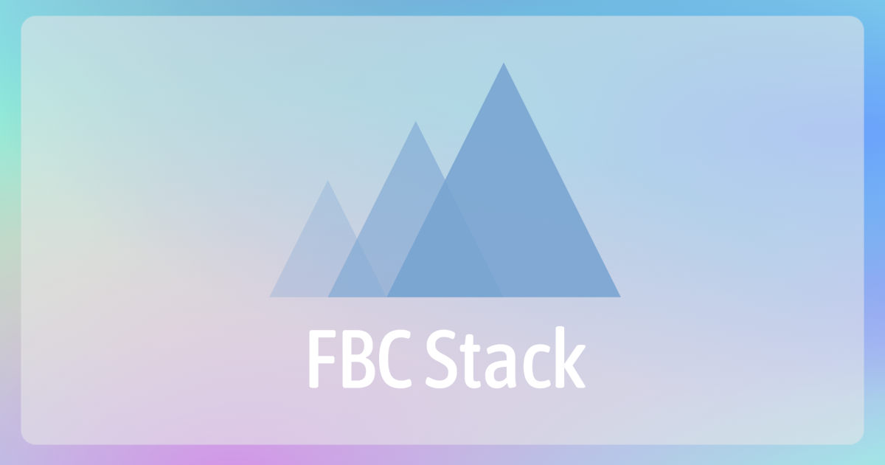

# FBC-Stack

 

FBC Stackは、FBC(Fjord Boot Camp)の卒業生が作成したサービスの技術スタックデータベースです。
サービスを構成するツール（技術要素）について紹介しています。


# 技術スタック

[](https://fbc-stack.vercel.app/posts/fbc_stack)


# 使い方

## インストール

```
$ npm i
```

## 開発環境の起動

```
$ npm run dev
```

## 本番環境の起動
```
$ npm run build
$ npm run start
```

## Linterの実行

```
$ npm run lint
```

## Formatterの実行

```
$ npm run format
```

## テスト

```
$ npm run e2e
```

## 本番環境設定

OGP用のURLとGAの設定を環境変数で設定します。

| 環境変数 | 説明 |
| --- | --- |
| NEXT_PUBLIC_BASE_URL | デプロイ先のベースURL (ex: https://example.com) |
| NEXT_PUBLIC_GA_ID　| Google AnalyticsのトラッキングID |


# Author

* [GitHub](https://github.com/mh-mobile)
* [Qiita](https://qiita.com/mh_mobiler)
* [Zenn](https://zenn.dev/mh)
* [Twitter](https://twitter.com/mh_mobiler)

# ライセンス

本ソフトウェアは、MITライセンスの元提供されています。
